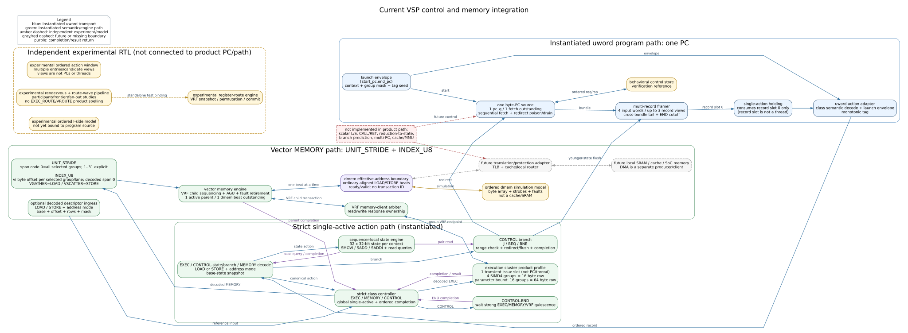

# 当前控制与内存集成状态

本页只回答“当前哪些模块确实连在同一条程序路径中”。独立实验 RTL 与仿真模型单列，
避免把模块存在误读为产品路径已经采用。



Graphviz 源文件为 [`current-integration.dot`](current-integration.dot)。

## 1. 当前可运行闭环 `[RTL事实]`

当前有一个 encoded uword 程序入口和一个 decoded MEMORY 参考入口；二者最终复用同一
strict controller、execution cluster 和 vector memory engine。encoded program wrapper
保留 behavioral control-store profile，同时新增 external-provider profile；后者把 I/D 两侧
闭合到共享 MMU 和 physical fabric：

```text
launch(start_pc,end_pc,context,group_mask,tag_seed,
       ifetch_addr_space,ifetch_addr_context)
  -> one linear byte PC
  -> external IFetch provider seam
  -> redirect-aware bridge / bundle adapter
  -> shared iMMU + independent I-region + read-only I-cache
  -> 4-word fetch bundle / multi-record framing
  -> raw record holding
  -> semantic action adapter / decoded-action holding
  -> final EXEC expansion / canonical-action holding
  -> strict single-active EXEC / MEMORY / CONTROL controller
  -> one-issue-slot, four-SIMD4 execution/memory integration
  -> LSU + address routers + shared MMU/TLB/PTW
  -> D-cache / direct-local SRAM / uncached-device endpoint
  -> shared physical fabric <- I-cache / PTW / D-cache / uncached-device
  -> generic ordered physical lower port
```

原有 `vsp_uword_cached_program_wrapper` 仍从 behavioral control store 取指，用于已有 D-side
动态回归。新的 `vsp_uword_memory_system_wrapper` 静态选择 external provider，并实例化
request bridge、共享 iMMU client、独立 I-region router 和 I-cache；它不是两个取指源的
运行时 mux。最后一个 lower port 仍需外部 SoC bus/target adapter，因此这些 RTL 接线不表示
AXI/NoC、DMA、真实 RAM/MMIO target 或 coherence 已经实现。

uword 路径目前可执行：

- profile-v0 EXEC；
- sequencer-local `SMOVI`、`SADD`、`SADDI`；
- single-PC `J` 与 `BEQ/BNE/BLT/BGE/BLTU/BGEU`（`*Z` 形式为 assembler 伪指令）；
- `VLOAD`、`VSTORE`、`VGATHER`、`VSCATTER` MEMORY record；
- 最终 `CONTROL.END` 与有序 action completion。

decoded MEMORY 入口则直接提交已经解析的 descriptor，便于单独验证 engine。encoded
MEMORY 并没有复制一套内存实现：semantic decoder 在 admission 时读取 sequencer state
base，并把 resolved descriptor 写入 decoded-action holding，随后仍进入同一个 vector
memory engine。

当前集成参数必须按下表理解：

| 项目 | 当前产品参考实例 | 当前 profile 参数上限 |
|---|---:|---:|
| program PC | 1 | 当前没有多 PC profile |
| issue slot | 1 | 其他数量仅为可参数化/独立实验，不表示线程数 |
| SIMD group | 4 | 16 |
| physical byte lane | 16 | 64 |
| 分布式 VRF row 宽度 | 16 byte | 64 byte |

每个 SIMD group 固定贡献 4 个 8-bit physical lane。16-group/64-byte 是当前 memory
engine 与 wrapper 的参数合法上限，不表示现有产品参考实例已经部署 16 group。

## 2. 单 PC、fetch 与 issue slot `[RTL事实]`

program source 只有一个 `pc_q`、一个 `[start_pc,end_pc)` launch range 和一个 fetch
outstanding。PC 是 control-word stream 的 byte cursor；每个 32-bit base/body/extension
word 都占 4 byte：

```text
word address       = bundle_base_pc + 4 * word_index
next bundle base   = bundle_base_pc + 4 * accepted_word_count
next record header = record_start_pc + 4 * record_word_count
```

默认 fetch 最多返回四个 word，因此满 bundle 被接收后通常表现为 `PC + 16`，短 bundle
则可能 `+4/+8/+12`。这不是每条操作固定 16 byte，也不是四个 PC。CONTROL branch
使用相对 header PC 的 signed byte displacement 更新同一个 PC；当前仍没有 CALL/RET、
间接跳转、预测或异常重启 PC。

branch 解析时，strict single-active 已保证更老 action 完成、没有年轻 action 进入执行
engine。program source 会丢弃 held bundle，并对唯一的旧 outstanding response 做
poison/drain；multi-record framer 同时清除年轻 word、continuity、EOF 和预取 END 状态。
已经越过 framer、滞留在 raw-record holding 的年轻 record 也由 redirect 显式清除。首版
对 taken 与 not-taken 都执行这套 redirect/refetch，优先保证一种恢复合同。

external-provider profile 导出与 control store 相同的 PC/count request 和 packed-word/fault
response，以及上述同一个 committed redirect event。request bridge 先捕获 source request，
再以 canonical ready/valid 规则驱动 IFetch；redirect 不取消已接受的 bridge/cache/MMU
transaction，而是让其完成并丢弃 stale response。launch 的 I-side address-space/context 在
实际 start handshake 快照，不能用 execution context 代替 address context。

multi-record framer 可以同时看见最多三条完整 record，但产品 wrapper 只把 record slot 0
送入 raw-record holding；class semantic decoder 后面另有一个 decoded-action holding。
MEMORY 的 resolved base 与 CONTROL fields 在这里锁存，EXEC 则锁存已经配对的 base/
extension packet。送往 cluster 的 action 随后经过最终 EXEC expansion/legality，并写入
一项 non-flow-through canonical-action holding；MEMORY 与 END 也跨过同一边界。两项
holding 都不是 issue slot，均不支持 consume/replace 同拍发生，也不会隐藏第二个 active
parent。execution wrapper 当前有一个 issue slot；它只是某拍把一项 command 交给执行
前端的瞬时端口，不保存 PC、不拥有程序，也不是 hardware thread。execution context
同样只是所有权、队列和 completion 身份，当前没有 context-local PC。

每个被选 SIMD4 在 command 进入后使用统一的 `O -> X -> RED/WB` 顺序流水：O 捕获
RF operands/control，X 捕获 route/主运算结果，RED/WB 从注册结果做可选 reduction 并
提交 RF 与 completion。O、X 都是一项 elastic holding，不是两个 issue slot 或两个
线程；无背压时二者可以每拍替换。masked forwarding 覆盖两项在途 producer，输出
背压则从 X 向 O 传播。

## 3. 两种 MEMORY 地址模式 `[RTL事实]`

semantic MEMORY record 在 admission 后形成以下 parent descriptor：

```text
LOAD / STORE + UNIT_STRIDE / INDEX_U8
context + tag + group mask
address-space + address-context
base_eaddr + signed offset
data VRF row
UNIT_STRIDE: resolved span_bytes
INDEX_U8:    index VRF row, span_bytes = 0
```

### 3.1 `UNIT_STRIDE`

从 `base_eaddr + signed offset` 开始按地址连续搬运。被选 group 按编号升序消费连续的
4-byte beat；稀疏 group mask 只改变 VRF 目的/来源，不在内存地址中制造洞。最后一个
group 可通过 byte mask 只提交部分 byte。例如：

```text
group_mask = 4'b1011, span_bytes = 10, eaddr0 = 0x100

0x100..0x103 -> group 0, VRF[row], byte mask 1111
0x104..0x107 -> group 1, VRF[row], byte mask 1111
0x108..0x109 -> group 3, VRF[row], byte mask 0011
```

它不是一次 10-byte 原子访问，而是三个顺序 beat。LOAD 的每个 beat 等待 dmem response
和 VRF write completion；STORE 先等待 VRF read data/completion，再等待 dmem write ack。

uword header 中保存的是五位 `span code`，不是下游 engine 的最终宽度：code `0` 表示
“每个被选 group 搬满 4 byte”，action adapter 按已经捕获的 `group_mask` 将其解析为
`4 * popcount(group_mask)` byte；code `1..31` 表示显式 byte span。这样 16-group profile
可用 code `0` 表达完整 64-byte 传输。需要大于 31 byte 且带尾部 partial group 的线性
传输应拆成多条 command；进入 engine 的 `span_bytes` 已经是普通非零 byte 数。

### 3.2 `INDEX_U8`

每个被选 group 的四个 physical byte lane 都从分布式 `vi` row 读取 unsigned 8-bit
offset：

```text
byte_eaddr(group,lane) = base_eaddr + signed_offset + vi[group][lane]
```

`LOAD + INDEX_U8` 是 gather：每个 lane 发一个对齐的普通 LOAD beat，从响应 word 中选择
目标 byte，四个结果组成该 group 的 `vd` row。`STORE + INDEX_U8` 是 scatter：engine
先读 `vi` 和 `vs` row，再为每个 lane 发一个只打开目标 byte strobe 的普通 STORE beat。
group 与 lane 都按编号升序执行；重复 scatter offset 因而由较晚 lane 最后覆盖。

内部 assembler 使用：

```text
VGATHER  sbase=<state row> vd=<data row> vi=<index row> [offset/space/addr_context]
VSCATTER sbase=<state row> vs=<data row> vi=<index row> [offset/space/addr_context]
```

二者仍是 MEMORY record：header bit 25 选择 LOAD/STORE，bit 0 选择 `INDEX_U8`，`[5:2]`
保存 index VRF row，bit 1 保留为零。`VLOAD/VSTORE` 的 bit 0 保持零，`[5:1]` 是上述
`span code`。`INDEX_U8` 的 decoded span 始终为零；其传输量由被选 group 数决定。

## 4. 当前 outstanding 合同 `[RTL事实]`

vector memory engine 是：

```text
1 active MEMORY parent + 1 dmem beat outstanding
```

`dmem_req/rsp` 没有 transaction ID。每个 accepted LOAD 或 STORE beat 必须严格返回一条
response；STORE response 是 write acknowledgement。下一条 unit-stride beat或下一条
indexed lane access都要等待当前 response。request、response 和 parent completion 均
支持 ready/valid 背压。

这种合同让 fault、partial commit 和 retirement 顺序明确。允许多个无 ID outstanding
需要 requester 用 FIFO 保存每个 beat 的 group/lane/address/fault metadata，并要求严格
按请求顺序响应；允许乱序响应还必须增加 transaction ID 与 scoreboard/reorder 状态。
因此不能仅把一个深度参数调大就宣称多 outstanding。

`vsp_ordered_dmem_model` 可模拟更深的无 ID ordered endpoint，但当前 engine 实际只占用
一项。它仍是 byte-array protocol oracle，不是 D-cache、SRAM、MMU 或 DMA。

产品组合现在有三层实际接线：

- `vsp_dmem_cached_fabric_wrapper` 把 effective beat 依次接入 LSU、地址路由、共享
  MMU/TLB/PTW、D-cache、direct-local SRAM、uncached/device endpoint 和 physical fabric；
- `vsp_uword_cached_program_wrapper` 直接连接 program wrapper 的 `dmem_req/rsp` 与上述
  D-side，不再在两者间插入 testbench data-memory model；其 instruction source 仍是
  behavioral control store；
- `vsp_uword_memory_system_wrapper` 改用 external IFetch provider，连接 request bridge、共享
  iMMU、独立 I-region、read-only I-cache 和统一 maintenance controller，并把 I-cache lower
  master 接入同一个 physical fabric。

program-level 回归已经运行一个三次迭代的 16-byte
`VLOAD -> saturating add -> VSTORE` physical/cacheable 循环，并在 completion 背压下检查
MEMORY completion metadata、management interlock、cache event 和 backing SRAM；当前结果为
580 integration checks、669 cycles、28 lower beats。D-side 独立 product 回归另覆盖 LOCAL、UNCACHED、
DEVICE、BARE translation、cache maintenance 和 fabric drain。准确的物理边界见
[memory subsystem integration](../integration/memory-subsystem.md)。

combined wrapper 另有独立的同顶层动态回归：从 shared-lower SRAM 中的 program image
取指，运行 PHYSICAL I+D branch loop，并覆盖 startup quarantine、程序活动时 maintenance
interlock、MMU-config ownership/response 背压、maintenance 同拍优先、完整 host `FENCE_I`
序列与重跑。该回归现已扩展到真实两级 Sv32 TRANSLATED IFetch、warm iTLB/I-cache、
context/PTE/region/lower fault 的详细归因及修复重跑；真实 SoC lower target 与完整程序
outstanding-miss redirect 的交错仍待覆盖。VSP-owned client 定向测试单独检查 metadata
背压和三种 redirect 时机。具体测试范围与诊断合同见
[memory subsystem integration](../integration/memory-subsystem.md#ifetch-fault-contract)。

## 5. CONTROL、state 与结束 `[RTL事实]`

`vsp_sequencer_state_engine` 当前每 context 有 32 个 32-bit state register，register 0
恒零；`SMOVI/SADD/SADDI` 按模 \(2^{32}\) 回绕。MEMORY decoder 只在完整合法 record
可见且更老 action 已静止时查询 base；resolved descriptor 进入 decoded-action holding
后，后续 state 写不能改变它。branch 的 pair-read 则留在有序 dispatch 点，读取最新已
提交 scalar state。state engine 不持有 PC，也不直接访问 dmem。

`J` 与六种比较 branch 由 program wrapper 的 CONTROL-flow path 执行。比较 branch 使用
state RF 的无副作用双源 query；`BLT/BGE` 按 signed 32-bit，`BLTU/BGEU` 按 unsigned
32-bit。目标经 widened arithmetic 检查，避免 PC 模回绕伪装成合法地址。
合法 taken target 必须 4-byte 对齐并落在 launch 的 `[start_pc,end_pc)` 内。运行时非法
目标产生有序 `CONTROL_ERROR` completion 且不重定向。

`CONTROL.END` 等待 EXEC queue/ingress/tracker/completion、MEMORY parent 与 VRF arbiter
达到强静止后退休。成功 END completion 被接收时产生单拍 `program_done`。它不清 RF、
不转移 group owner，也不等同于 host interrupt。

MEMORY fault 当前作为有序错误 completion 退休并置 sticky `program_error`，不会自动 trap
或 redirect；若程序随后执行合法 END，host 可能同时观察到 done 与 error。详细 fault、
partial 和 group progress 已透出，但程序内还没有读取这些状态并分支的路径。

cached program wrapper 只在 MMU/cache 初始化完成、fabric 离开 quarantine、整条 D-side
及 lower provider quiescent 时允许 launch。MMU configuration、TLB invalidate、D-cache
maintenance 和 fabric drain 共用一项 registered management lane，只能在 program inactive
且 memory quiescent 时接受。这仍是 behavioral-fetch/D-only bring-up profile。

combined memory-system wrapper 则要求 I/D path、maintenance controller 和 lower provider
全部 ready/quiescent 才接受 launch。它只在 `program_active=0` 时向 global maintenance
controller 提交 host command；接受后同时 quiesce 新的 I/D admission，再串行执行 I/D
cache、统一 TLB 和 fabric action。mid-program `FENCE.I` 与 LSU barrier-to-global policy
bridge 仍不存在，AXI/NoC/DMA quiescence 也仍由 wrapper 外部负责。

## 6. 独立实验与仿真模块 `[experimental]`

以下模块仍可独立编译和测试，但没有连接当前 PC/framer/action-adapter 产品路径：

- `vsp_ordered_action_window`：多 entry、多个 candidate view 的依赖/退休实验；
- `vsp_cluster_register_route_engine`：VRF 寄存器重排实验；
- `vsp_route_rendezvous_table`、`vsp_route_wave_controller`、
  `vsp_cluster_route_wave_pipeline`：participant 配对、frontier 与 fan-out 实验；
- `vsp_ordered_ifetch_model`：独立 I-side 协议 oracle；combined product path 使用真实
  bridge/IFetch/I-cache 组合，不实例化该模型。

当前 assembler 不提供 `EXEC_ROUTE`/`VROUTE`，产品 execution wrapper 也把内部 route
控制固定为禁用。实验 route RTL 的存在不表示当前程序支持全域寄存器路由、多 PC wave
或跨线程 rendezvous。

## 7. 后续边界 `[候选]`

当前仍缺少 scalar load/store、reduction/count 写 state、CALL/RET/间接跳转、
CSR、特权态和中断入口。未来若把多 record admission/window 接入产品路径，需要显式
描述 state RAW/WAW、resolved base、VRF row 和 MEMORY 依赖；不能把更多 record view
或 issue slot 当成多 PC。

地址侧当前已经按以下两条逻辑前端分层，并只在共享 MMU/fabric 层次合流；最后一行仍在
wrapper 外：

```text
MEMORY semantic decode / scalar-address state
  -> vector transfer planner + UNIT_STRIDE/INDEX_U8 AGU
  -> outstanding / response / fault transaction engine
  -> dmem effective-address port
  -> LSU + translation/protection + local/cache endpoint policy
  -> D-cache / local SRAM / uncached-device adapter + physical fabric

program source external-provider seam
  -> redirect-aware bridge + IFetch bundle adapter
  -> shared iMMU + independent I-region policy
  -> read-only I-cache + shared physical fabric

shared physical fabric
  -> SoC target decode / bus / RAM / MMIO
```

program fetch 与 data memory 保持两个逻辑前端；当前 product profile 已在下游共享 MMU/PTW
和 fabric，而不是让 data AGU 修改程序 PC。

尚需明确的集成语义包括：direct `LOCAL` 地址究竟长期表示 offset 还是带基址的地址（首个
profile 采用 base zero）；trusted uword 是否有权直接指定 PHYSICAL/address context；LSU
barrier 如何映射为 I/D cache、TLB 和 fabric maintenance；以及 lower port 下方怎样区分真实
RAM 与具有副作用的 MMIO target。另一个现有接口不对称是顶层
`protocol_error_clear_i` 不能清除 reset-only sticky 的外部 I/D cache adapter error；aggregate
可能在 clear 后继续为高，不能把它当作统一 clear-all 操作。IFetch cause/eaddr/paddr
现已与 bridge source response 对齐，并由 host RTL 端口记录有效路径上的首个已消费
fault；程序 active 时该记录仍可被 committed redirect 撤销。CSR/MMIO 软件诊断映射尚未
接入，详细资格与读取时点见
[IFetch fault 合同](../integration/memory-subsystem.md#ifetch-fault-contract)。
