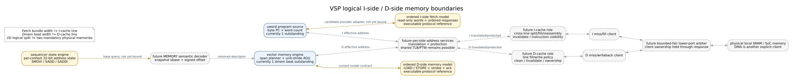

# I-side / D-side 内存模型边界

> 状态：逻辑端口和仿真合同已形成；I-cache、D-cache、MMU、物理 SRAM 与一致性策略
> 仍是后续集成项。本页描述预期分层，不指定 cache 容量、行宽或替换算法。



Graphviz 源文件为 [`memory-hierarchy.dot`](memory-hierarchy.dot)。

## 1. 为什么先分逻辑端口

程序流和数据流有不同事务语义，应在进入存储层时保持两个 client：

| 边界 | I-side program fetch | D-side vector memory |
|---|---|---|
| 操作 | 只读连续 uword bundle | LOAD/STORE beat |
| 当前宽度 | 最多 4×32-bit word | 默认 4 byte |
| 地址 | byte PC | effective data address |
| 写掩码 | 无 | byte strobe |
| 返回 | packed words + fault | read data/write ack + fault cause |
| 当前请求端能力 | program source 单 outstanding | memory engine 单 dmem beat outstanding |

这两个宽度都不是 cache line 规格。`4 words = 16 bytes` 只表示一次 fetch response
上限；`4-byte dmem beat` 只表示当前 SIMD4 VRF row 的传输颗粒。未来 cache line 可以
更宽，并由各自 provider 处理跨 line 的拆分、fill 和响应重组。

I/D 分开也不要求两套物理存储。两个 miss/writeback client 可以在下游通过有界公平
arbiter 共用一个 SRAM 或 SoC memory port；仲裁不得把 I/D 的 ready/valid、fault 和
outstanding 生命期合并为一套含糊状态。

## 2. 当前可执行模型

当前有两个彼此独立的仿真 endpoint：

- `vsp_ordered_ifetch_model`：read-only word backing、byte-PC、1–4 word response、
  address-space/fault 检查、可配置 fixed latency 与 ordered outstanding FIFO；
- `vsp_ordered_dmem_model`：byte backing、LOAD/STORE、write strobe、每个 STORE 一条
  acknowledgement、fault 与 ordered outstanding FIFO。

它们是协议 oracle，不是 cache。reset 丢弃在途响应但保留 backing 内容；初始化和
观察 sideband 不冒充 VSP transaction。

现有 `vsp_uword_program_source` 仍直接连接 behavioral control store，且把 fetch fault
折叠为一个 bit。新 I-side 模型额外保留 `addr_space`、`addr_context` 和详细 fault cause，
因此接入程序闭环前还需要一个很薄的 launch-context/fault adapter，或等价地扩展
program-source 合同。该差异是显式待办，不应靠常量绑死后宣称 MMU 已兼容。

## 3. 地址空间和 MMU 扩展点

I-side 与 D-side request 都应最终携带：

```text
effective address + address-space kind + opaque address context
```

- `LOCAL`：路由到 VSP 本地存储，不要求页表翻译；
- `PHYSICAL`：已经是物理地址，但仍需保护和 endpoint 路由；
- `TRANSLATED`：每个实际 memory beat 经过 translation/protection；没有 translator 时
  返回 translation fault，而不是把地址当作 LOCAL 使用。

跨页 vector transfer 必须逐 beat 检查，不能只翻译 parent base 后假设后续虚拟页物理
连续。I-cache 若位于翻译之前，其 tag 必须包含足以区分 address context 的信息；若位于
翻译之后，则由前级 translation/TLB 提供物理地址。当前不选择其中一种物理实现。

execution context 负责 action 所有权和 completion 回送；address context 负责翻译/
保护域。两者不能互相替代。

## 4. I-cache 与 D-cache 的候选职责

### I-cache role

- 接收 word-aligned byte PC 与 word count；
- 对跨 line bundle 做拆分和有序重组；
- response 被背压时保持全部 words/count/fault 稳定；
- miss request 的 PC、count、context 和 tag 必须在握手时锁存；
- program backing 被 host/DMA 修改后，通过 launch 边界 invalidate，或未来显式
  `FENCE.I`/invalidate 操作建立可见性。

### D-cache role

- 保持 LOAD data 与 STORE byte strobe/ack 语义；
- fault 与 partial-commit 顺序继续由 vector memory transaction engine 可观察；
- DMA/host 与 VSP 共享数据时需要明确 clean/invalidate/ownership 协议；当前不声明
  hardware coherence；
- indexed gather/scatter 若以后需要，应作为独立 address/request engine 接到 D-side，
  不修改 I-side，也不让 cache 猜测 vector register 语义。

首个物理版本可以完全没有 cache：I-side 接 program SRAM，D-side 接 local SRAM，
再由 DMA 在 kernel 启动/结束边界搬运。逻辑拆分仍然成立。

## 5. Sequencer 地址状态

`vsp_sequencer_state_engine` 已提供第一版 decoded address-state reference：

- 默认每 execution context 具有 32 个 32-bit state register；寄存器 0 恒为零；
- `SMOVI`、`SADD`、`SADDI`，按 32-bit modulo arithmetic 工作；
- command/completion 均可背压，completion stalled 时不会重复写状态；
- 组合 base query 供未来 MEMORY decoder 在 **action admission** 时快照地址。

该模块不持有 PC、不发 memory request，也没有 flags、branch、loop、scalar load/store、
CSR 或中断入口。它只是 sequencer 生成地址、stride 和 count 的状态，不是一颗独立 CPU。
当前尚未把它接到 CONTROL-uword decoder 或 encoded MEMORY path。

## 6. 后续实现顺序

1. 定义 MEMORY record semantic decode，并在 admission 时读取/快照 state base；
2. 给 program launch 增加 I-side address-space/context，接通 ordered fetch provider；
3. 若 I/D 最终共享端口，实现单 lower-beat outstanding 的公平 adapter，并覆盖 I/D
   竞争、response 背压、fault 累积和 reset；
4. 有 workload 命中率与带宽数据后，再选择 I-cache/D-cache line、容量和 replacement；
5. 引入 DMA 前定义数据 ownership 与 cache maintenance；引入 self-modifying program
   前定义 instruction visibility。

这里没有把 cache 设为必须。独立逻辑端口、地址元数据和事务合同才是本阶段需要保留的
设计空间。
