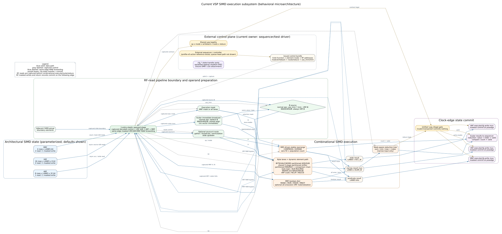
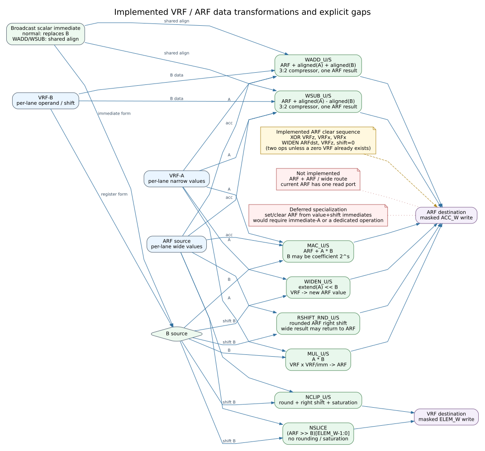

# 当前 SIMD 微架构图

本页描述单个 SIMD4 的当前行为数据通路，不规定指令位宽、编码、物理 SRAM bank
或未来 VSP 的控制层级。产品 wrapper 已采用统一的 `O -> X -> RED/WB` 流水；若目标
实现以后需要在 X 内部继续物理切分，那仍属于后续实现选择。上级控制、PC 与 memory 的实际接线另见
[当前控制与内存集成状态](current-integration.md)。

## 总体数据通路



Graphviz 源文件为 [`microarchitecture.dot`](microarchitecture.dot)。蓝色实线表示
数据流，灰色虚线表示 sequencer 发出的控制，紫色框表示配置/状态传输与提交路径。

本图画单个 SIMD4，包括 group 内已经实现的 `simd_uop_legal` 与统一 illegal
side-effect gate。`simd_cluster_issue_frontend` 位于图外的 cluster 控制
边界；它已集成 queue、RR live-head、opaque locked shadow、reject credit 和
dispatcher。`simd_cluster_exec` 又在其外加入 per-group ingress、四个 wrapper、
tracker、reject buffer 和 result collector，形成 full-decoded EXEC 参考闭环。
profile-v0 canonical expander 与 strict class router 已在更外层的 controller wrapper
接入；byte-PC source、control-store model、multi-record framer、slot-0 action adapter
与 strict EXEC/MEMORY/CONTROL program wrapper 也已接通。当前产品路径是单 PC、单
issue slot、global single-active；多 record 并发 admission、ordered action window 和
queue-head late-decode 集成仍是吞吐实验，不属于当前执行 profile。
已经实现的 `simd_group_wrapper` 也位于本叶数据
通路图外，负责 decoded EXEC、state-write 与 VRF state-read ready/valid、状态访问
仲裁、RF-read operand stage、execute-result stage、post-X reduction/retirement、
覆盖两项在途 producer 的同拍 RAW forwarding 和独立返回缓存，见
[指令交付](../design/instruction-delivery.md)与
[开发路线](../design/development-roadmap.md)。
`simd_group_completion_tracker` 与 `simd_cluster_result_collector` 也位于图外；
前者聚合 EXEC group completion 并保留 expected-result 生命期，后者捕获
per-group result 并产生 retire pulse，二者已接入 cluster execution integration。
`vsp_vector_memory_engine` 同样位于图外；它是 VRF-only blocking engine，
每次处理一个 command 和一个 outstanding memory beat。它同时支持 unit-stride 和
`INDEX_U8`：LOAD/gather 经 VRF state-write subrequest 提交，STORE/scatter 收齐 VRF
read subrequest 的 completion 与 data response 后再写 memory。
`vsp_cluster_vrf_arbiter` 已把这些 subrequest 接到 cluster wrapper；
`vsp_cluster_memory_wrapper` 再把 vector memory engine 与 full-decoded EXEC integration 组合成
decoded reference integration。`vsp_cluster_controller_wrapper` 在其外增加一个统一
action 入口、profile-v0 EXEC 展开、strict program ordering、统一 completion 和
`CONTROL.END`；它仍未接物理 local SRAM 或 DMA。
`dmem_req/rsp` 是无 ID 的单飞行有序 data-memory 逻辑口；它携带
address-space/address-context 与 fault cause，但 engine 内没有 MMU、TLB、
PTW 或 cache。`sim/models/vsp_ordered_dmem_model.sv` 为该逻辑口提供 byte-addressed、
严格顺序的可配置 outstanding 仿真 endpoint；它不属于物理 memory hierarchy，也
不是 IFetch 端口。

当前 SIMD4 没有取指。controller reference 中的 byte PC 只顺序读取内部 uword
control store，不改变这项边界。上级已有 `simd_issue_decode_stage` 作为晚译码 holding
边界，但其 hook 尚未替换为 admission/queue-head 解析；另一路 controller reference
已组合解析 profile-v0 EXEC packet。`op_i`/`exec_op_i` 上的
6-bit `simd_op_e` 只是 canonical EXEC function，不是完整 opcode。
寄存器地址、立即数、mask、route、reduction 和写回控制均为并行发射信号。
当前没有已定义的 32/16-bit instruction；queue 的 32/16/16 只是 opaque
默认宽度。未来 sequencer 可以选择 32-bit 微指令、扩展字或内部控制存储，
只要最后生成图中的发射控制即可。

## 寄存器与立即数操作数

VRF 保留两个寄存器读源：

```text
A = optional_route(VRF[src_a])
B = use_imm ? broadcast(scalar_imm) : VRF[src_b]
```

`elem_mode=BYTE/HALF/WORD` 把 1/2/4 个相邻 byte slice 解释为一个逻辑元素。
当前动态路径包含一条可切断进位的 byte-slice 加减链、一套共享的五级
partitionable barrel shifter，以及一条传播 equal/greater 状态的 byte 比较链。
它们分别形成 `4x8/2x16/1x32` 运算，不实例化三套不同宽度的加法器、移位器或
comparator。比较链同时驱动整元素 `MIN/MAX` 和复制到物理 byte lane 的 MRF
谓词。

`COMPRESS/EXPAND` 也读取上述可选 route 后的 A，但绕过逐 lane ALU，由 MRF
生成稳定重排。它返回窄向量、结果有效 mask，以及供 sequencer 使用的
`count + valid`。这仍是组内操作；跨组稀疏 packet 的拼接尚未进入本数据通路。

MRF 另有一个很小的布尔 ALU。发射 `MAND/MOR/MXOR/MNOT` 时，两个 MRF 端口
从“执行 mask / SELECT 条件”切换为普通 A/B 数据源，结果可整行写回 MRF；
同一结果还能以每 lane 全一/全零的形式进入窄结果 mux，并按需写入 VRF。

上述 B mux 适用于普通 ALU、MAC、WIDEN 和宽窄转换。三输入 WADD/WSUB 是例外：
它们始终把 VRF-B 当作第二个数据源，`use_imm/imm` 改为选择一个 A、B 共用的
广播对齐量；没有立即数时对齐量为零。

当前接口只提供广播标量立即数。BYTE/HALF/WORD 分别广播低 8/16/32 bit；当前
control scope 没有把若干互不相同的 lane 值直接塞入指令字的“向量立即数”。

寄存器型 VRF-B 是有现有负载依据的 baseline。它能为每个 lane 提供不同的数据、系数或移位量，
例如四个 lane 同时选择四个不同 bit slice。广播立即数适合所有 lane 共享的
系数、阈值和 shift；二者在 B-source mux 汇合。

## VRF 与 ARF 的宽窄数据流



Graphviz 源文件为 [`wide-narrow-dataflow.dot`](wide-narrow-dataflow.dot)。绿色框是
已实现操作；红色便签是当前明确缺失或暂缓的路径。

当前关键语义为：

| 操作 | 读取 | 宽结果 |
|---|---|---|
| `WIDEN_U/S` | VRF-A、B shift | `extend(A) << B`，覆盖写一个 ARF 目的 |
| `WADD_U/S` | ARF、VRF-A、VRF-B、shared align | `ARF + aligned(A) + aligned(B)` |
| `WSUB_U/S` | ARF、VRF-A、VRF-B、shared align | `ARF + aligned(A) - aligned(B)` |
| `MUL_U/S` | VRF-A、B | `A * B`，覆盖写 ARF |
| `MAC_U/S` | ARF、VRF-A、B | `ARF + A * B` |
| `RSHIFT_RND_U/S` | ARF、B shift | 舍入右移后的宽结果 |
| `NSLICE` | ARF、B shift | 精确截取到 VRF |
| `NCLIP_U/S` | ARF、B shift | 舍入、右移、饱和后写 VRF |
| `COMPRESS/EXPAND` | VRF-A、MRF | 稳定组内重排，输出窄结果、mask 和 count |
| `MAND/MOR/MXOR/MNOT` | MRF-A、MRF-B | 布尔条件组合，写 MRF 或物化到 VRF |

当前没有更宽 multiplier 的 RTL。WORD 低 32-bit 乘法已有一套 8×8 部分积卷积
参考映射；十条无 compressor 的候选微码和可选四对角线加速见
[32-bit byte卷积乘法模型](../explorations/mul32-byte-convolution.md)。是否采用该
映射仍由吞吐与 PPA 决定。

因此 `WIDEN` 不读取旧 ARF；它是 VRF→ARF 的构造/覆盖操作。`WADD/WSUB`
读取旧 ARF 和两个窄源，分别扩展、使用同一个标量 align 左移，再通过一级
3:2 compressor 和一次最终进位传播加法产生一个 ARF 结果。compressor 的
sum/carry 不写寄存器。`MAC` 则走乘法积累加路径。

对 WIDEN、MAC、NSLICE、NCLIP 等操作，寄存器型 B 与替代 B 的标量立即数均
保留。对 WADD/WSUB，两个 VRF 端口都是数据，立即数只提供统一标度；没有立即数
时 align 为零。虽然 `WADD_S` 可以通过负的 B 表达减法，`WSUB_S` 仍保留，使
signed/unsigned 指令族保持对称，并让 `ARF+A-B` 无需预先构造负数。

## ARF 清零与设置

执行路径目前没有专用 ARF-clear 指令。已有操作可以组成：

```text
XOR    VRFz, VRFx, VRFx       // VRFz = 0
WIDEN  ARFdst, VRFz, shift=0  // ARFdst = 0
```

如果软件已经保留零 VRF，则清 ARF 只需后一条 WIDEN。`cfg_arf_write_i` 也可以
直接装载 ARF，但它属于状态传输/DMA 接口，不是执行指令。

定制一个同时携带 value 和 shift 的宽立即数设置操作，可以把任意统一值装入
ARF，也能以 value=0 清零；但它需要 immediate-A、第二立即数字段或专用控制。
目前尚无负载证明 ARF clear 是瓶颈，因此本图把它标为 deferred。若 trace 显示
清零/常量装载明显占用 issue 带宽，再重新比较专用接口。

## 当前周期模型

裸 `simd_datapath` 保留组合读取/执行接口；产品 `simd_group_wrapper` 的当前路径为：

```text
admit edge: async RF read -> O operand/control register
X edge:     O -> optional route / operand mux -> lane or group operation
              -> X execute-result register
RED/WB edge: X -> optional reduction -> RF retirement + completion/result
```

X 保存 narrow、wide、predicate、结果 mask、illegal、目的寄存器、reduction 控制和
completion 元数据。RED/WB 只消费这些注册值；裸 datapath 内原有的组合 reduction 输出
不参与产品 wrapper 的退休路径。所有操作因此具有统一级数，不因 MUL/MAC、NCLIP 或
reduction 切换成另一套 variable-latency 握手。

输出有 credit 时，X 退休、O 推进和下一条 admission 可以同拍发生。operand capture
先合并较老的 X 注册结果，再合并本拍 O→X 的较新结果，并按各自 masked write 逐 lane
旁路 VRF/ARF/MRF。这覆盖连续 `A -> B -> C` RAW 链。输出背压冻结 X，并自然反压 O；
同一项结果只退休一次。state-read/write 要等 O 与 X 同时为空。

## 执行级的结构深度与切分依据

下表是 RTL 运算链的相对比较，不是门级 STA，也不把某个综合工具的 generic-cell
结果解释成目标频率。相同 RTL 在 ASIC standard cell、FPGA carry chain/DSP、不同布局
和约束下可能改变排序；这里关心的是哪些功能在结构上可以串在同一条路径中。

| 候选路径 | 主要组合链 | 相对风险 | 当前边界 |
|---|---|---|---|
| `route + MAC` | group-local 4×4 byte route → 8×8 multiply → 32-bit accumulator add → result/mask mux | 高；同时包含选择网络、乘法和宽进位传播 | 完整留在 X；不会再串 reduction |
| dynamic WORD shift | 可选 route → 五级可分区 barrel；每级还受方向、元素边界和 arithmetic-fill 控制 → result mux | 高 mux 深度；不同于五个无条件直通小 mux 的理想化模型 | 完整留在 X |
| `WADD/WSUB` | A/B 各自 8→32 扩展并按 shared align 左移（两路并行）→ 3:2 compressor → 32-bit carry-propagate add | 高；barrel 后仍有一次完整宽加法 | 完整留在 X；该族不可接窄 reduction |
| `NCLIP_U/S` | 32-bit ACC 可变右移与 round-bit 选择 → rounding add → unsigned overflow 或 signed saturation 选择 | 高；barrel、宽加法和末端选择连续 | 完整留在 X；若请求 reduction，树位于下一拍 |
| reduction | 四个 physical byte lane 的 mask-aware balanced tree；两层 sum 或 compare/select，并产生 index | 中；树深为 `log2(4)`，但过去会追加在上述窄结果链之后 | 单独位于 RED/WB |

因此新增 X 寄存边界的首要收益不是宣称某个 MHz，而是禁止以下合法语义形成一个
组合周期：

```text
route / heavy primary operation -> result selection -> reduction -> retirement
```

现在最深的 X 候选仍大致是 `route+MAC`、dynamic WORD shift、WADD/WSUB 和 NCLIP；
RED/WB 则只承担注册窄结果后的 reduction、写口选择和返回生成。`COMPRESS/EXPAND`
内部 cursor 是随 lane 数线性展开的组合选择链，固定 SIMD4 时较短，但不应把该 RTL
直接参数放大成宽 compact 网络。

如果目标实现后来仍无法满足约束，优先在 X 内的自然中间量比较进一步切分，例如
MAC product、WADD/WSUB carry-save 结果或 NCLIP shifted value。那需要同步扩展 elastic
holding、旁路和 backpressure；在没有目标工艺证据前，当前不为简单操作引入不同延迟。

## 明确缺口

尚未实现的主要结构包括：

- 若测量后需要并发 admission：cached resource/dependency metadata、queue-head canonical
  expansion，以及把 strict slot-0 的 CONTROL-state/MEMORY resolved-base 语义迁移到
  action window；当前 32-bit state RF、`SMOVI/SADD/SADDI` 和 encoded
  `VLOAD/VSTORE/VGATHER/VSCATTER` 已在 global-single-active program closure 中闭环；
- per-context/concurrent class scheduling、长期资源预留、动态 owner table、一般化
  barrier/admin 与 host completion；当前 strict controller 已提供单 active action 的
  class routing、ordered error/completion 汇聚和 `END`；
- 物理 local SRAM、DMA、地址空间
  adapter 的集成与可选的多 outstanding、二维地址生成；vector-memory→shared VRF
  arbiter→wrapper 的 decoded reference wiring 已完成，当前 engine 仅支持 VRF，ARF 需先用
  `NSLICE/NCLIP` 转到 VRF 再 STORE；
- MMU/TLB/PTW/cache/coherence 和 architectural IFetch；standalone ordered I-side
  uword-fetch model 已与 dmem model 分开验证，但尚未接 program source 或实现 I-cache；
- ARF+ARF、宽 ARF route 和宽 reduction；
- 物理 bank 映射及 bank conflict 处理；
- 完整 VSP 层级和最终指令编码。

从仓库根目录重新生成图片：

```bash
dot -Tsvg docs/architecture/microarchitecture.dot -o docs/architecture/microarchitecture.svg
dot -Tsvg docs/architecture/wide-narrow-dataflow.dot -o docs/architecture/wide-narrow-dataflow.svg
```
